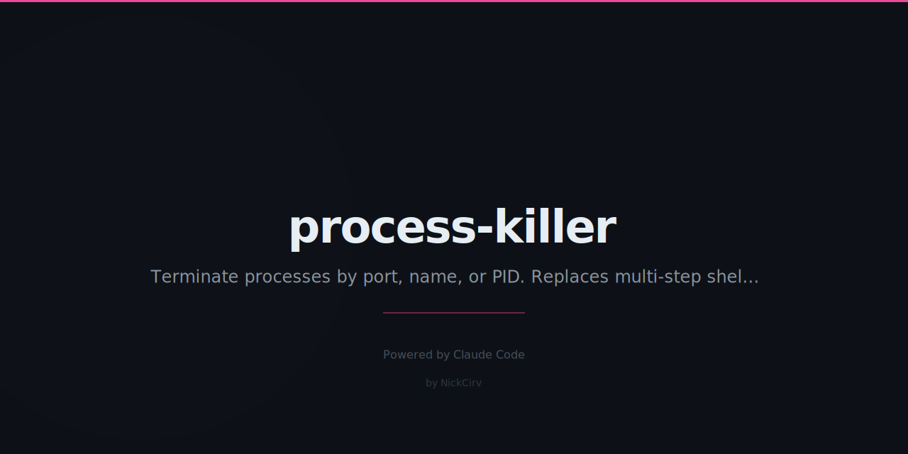

# process-killer

Kill processes by port, name, or PID. Replaces `lsof | grep | kill` muscle memory with a single command.

**Zero dependencies. Pure Node.js. macOS + Linux.**

## Install

```bash
npm install -g process-killer
```

Or run directly with npx:

```bash
npx process-killer 3000
```

## Usage

```
pk <port>               Kill process on port (most common)
pk --name <pattern>     Kill by process name pattern
pk --pid <pid>          Kill specific PID
pk list [--port <port>] List processes (or what's on a port)
pk tui                  Interactive process browser (TUI)
pk ports                Show all listening ports
pk clean                Kill all dev server processes
```

## Examples

```bash
# Kill whatever is running on port 3000
pk 3000

# Kill without confirmation prompt
pk 3000 --force

# Force-kill (SIGKILL) on port 8080
pk 8080 --signal SIGKILL

# Kill all node processes (shows list first, confirms)
pk --name node

# Kill python servers matching a pattern
pk --name "python.*server"

# Kill specific PID
pk --pid 12345

# List all user processes
pk list

# Show what's on port 8080
pk list --port 8080

# Show all listening ports with PIDs
pk ports

# Kill all dev servers (node, python, ruby, etc.) with confirmation
pk clean

# Launch interactive TUI browser
pk tui
```

## TUI Keys

| Key | Action |
|-----|--------|
| `up` / `down` | Navigate processes |
| `k` | Kill selected process |
| `s` | Send custom signal |
| `f` | Filter processes |
| `r` | Refresh |
| `q` | Quit |

## Options

| Flag | Description |
|------|-------------|
| `--force` | Skip confirmation prompt |
| `--signal <SIG>` | Signal to send (default: SIGTERM) |

Supported signals: SIGTERM, SIGKILL, SIGHUP, SIGINT, SIGQUIT, SIGUSR1, SIGUSR2

## Clean Command

`pk clean` kills processes matching common dev server patterns:

- node, bun, deno
- python, ruby, rails, puma
- uvicorn, gunicorn, flask, django
- next-server, vite, webpack, parcel, esbuild
- ts-node, tsx, nodemon

Always shows a list and asks for confirmation before killing anything.

## Implementation

- **macOS:** lsof for port lookup, ps aux for process list
- **Linux:** ss / fuser for port lookup, ps aux for process list
- **Kill:** process.kill(pid, signal) — Node built-in, no shell
- **Safety:** execFileSync and spawnSync only — no shell injection surface

## Requirements

- Node.js 18 or newer
- macOS or Linux
- Zero npm dependencies

## License

MIT
